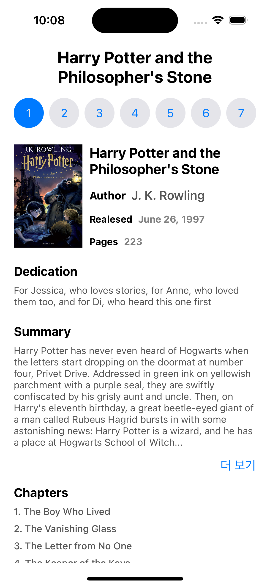

# 📚 JuseojosBook

MVVM 아키텍처와 Combine, 코드 기반 UI(Programmatic UI) 학습을 목적으로 제작한 iOS 도서 정보 앱입니다.

## 📸 스크린샷



## ✨ 주요 기능

* **시리즈 탐색**: 상단 버튼을 통해 각 시리즈의 도서 정보를 손쉽게 전환하며 볼 수 있습니다.
* **상세 정보 제공**: 책 표지, 저자, 출시일, 페이지 수 등 각 도서의 상세 정보를 한눈에 확인할 수 있습니다.
* **줄거리 확장/축소**: 내용이 긴 줄거리는 '더 보기'와 '접기' 버튼으로 편하게 읽을 수 있도록 구현했습니다.
* **상태 유지**: 각 책의 줄거리 확장/축소 상태는 앱을 다시 실행해도 그대로 유지됩니다.
* **동적 UI 생성**: `data.json` 파일에 담긴 챕터 목록을 읽어와 동적으로 화면에 표시합니다.


## 🛠️ 기술 스택 및 아키텍처

### 사용 기술
* **UI**: `UIKit` (Programmatic UI), `SnapKit`, `Then`
* **Architecture**: `MVVM`
* **Asynchronous**: `Combine`

### 아키텍처 - MVVM
관심사 분리를 위해 MVVM 아키텍처를 적용했습니다.

* **Model (`BookModel.swift`)**:
    * `Book`, `Chapter` 등 앱에서 사용할 데이터 모델을 정의합니다.
    * 중첩된 JSON 구조를 파싱하기 위해 `init(from: Decoder)`를 커스텀하여 구현했습니다.
* **View (`BookViewController.swift`, `BookView.swift`)**:
    * `UIKit`을 기반으로 모든 UI를 코드로 작성했습니다.
    * `BookViewController`는 ViewModel의 데이터를 구독하고, 사용자 입력을 ViewModel로 전달하는 역할을 합니다.
    * `BookView`는 UI 요소들의 레이아웃과 구성을 담당합니다.
* **ViewModel (`BookVM.swift`)**:
    * `DataService`로부터 데이터를 받아 가공합니다.
    * `Combine`의 `CurrentValueSubject`를 사용하여 View가 현재 상태를 실시간으로 구독하고 업데이트할 수 있도록 합니다.
* **Service (`DataService.swift`)**:
    * 로컬 `data.json` 파일을 로드하고 파싱하는 데이터 관련 로직을 담당합니다.

<br>

## 💡 주요 코드 및 고민한 점

### 1. 중첩된 JSON 데이터 파싱
`data.json`의 데이터가 `attributes` 키 내부에 중첩되어 있어, `Book` 모델에서 `Decodable`을 채택하고 `RootCodingKeys`와 `AttributesCodingKeys`를 사용해 직접 디코딩 로직을 작성했습니다.

```swift
// BookModel.swift
// ...
init(from decoder: Decoder) throws {
    let rootContainer = try decoder.container(keyedBy: RootCodingKeys.self)
    let attrContainer = try rootContainer.nestedContainer(keyedBy: AttributesCodingKeys.self, forKey: .attributes)

    title = try attrContainer.decode(String.self, forKey: .title)
    // ...
}
